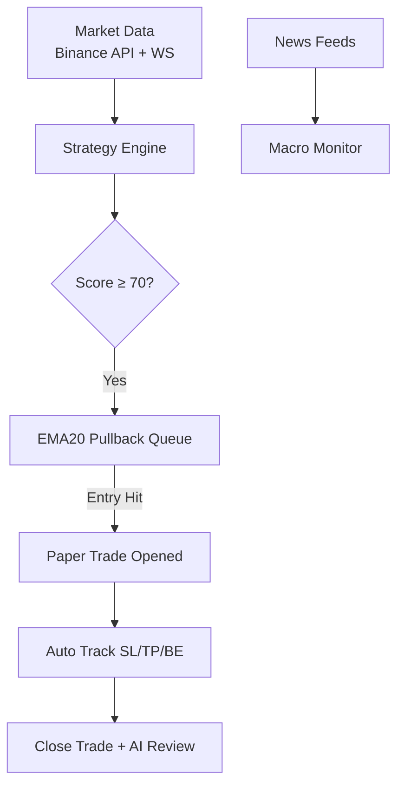

# ETH/USDT Quant Terminal

🌐 **Live Demo:** [Crypto-Bot Streamlit Dashboard](https://crypto-bot-kagmts7lraqwzmkumfeeqx.streamlit.app/)

   

An algorithmic trading research system for ETH/USDT. Features multi-timeframe signal generation, backtesting, SQLite paper trade tracking, DeepSeek AI reviews, and a sleek React-based terminal dashboard.


## 🚀 Quick Start

**1. Trading Engine (Python)**
```bash
git clone https://github.com/kevin6667890/crypto-bot.git
cd crypto-bot
pip install -r requirements.txt
cp .env.example .env
python ultimate_bot.py
```

**2. Terminal Dashboard (React)**
```bash
cd frontend
npm install
npm run dev
# Open http://127.0.0.1:5173
```
*Note: To run the Streamlit wrapper locally, use `streamlit run dashboard/streamlit_app.py`.*

## 📈 Strategy Overview
**Multi-Timeframe EMA20 Pullback**
- **Trigger:** Score ≥ 70 (based on 4H trend, 1H confirmation, 15m structure)
- **Entry:** Price touches EMA20 (within 40m timeout window)
- **Exit Logic:** 3R Take Profit / 1R Break-even / Structure-based Stop Loss

### Backtest Validation (2 Years)
| Metric | Value | Metric | Value |
| :--- | :--- | :--- | :--- |
| **Profit Factor** | 2.60 | **Win Rate** | 33.8% |
| **Annual Return** | +46.43% | **Total Trades** | 68 |
| **Max Drawdown** | 4.14% | **Risk/Reward** | 1:3 |


*See full strategy evolution and details in [docs/backtest_results.md](docs/backtest_results.md).*

## 🧠 System Architecture



## 🛠️ Tech Stack
- **Engine:** Python 3.10, `asyncio`, `pandas`, `ccxt`
- **Frontend:** React, TypeScript, Vite, Lightweight Charts
- **Database & AI:** SQLite, DeepSeek API
- **Infra:** Docker, GitHub Actions, Pytest

---
*Disclaimer: For educational and research purposes only. Not financial advice. Cryptocurrency trading involves substantial risk.*
