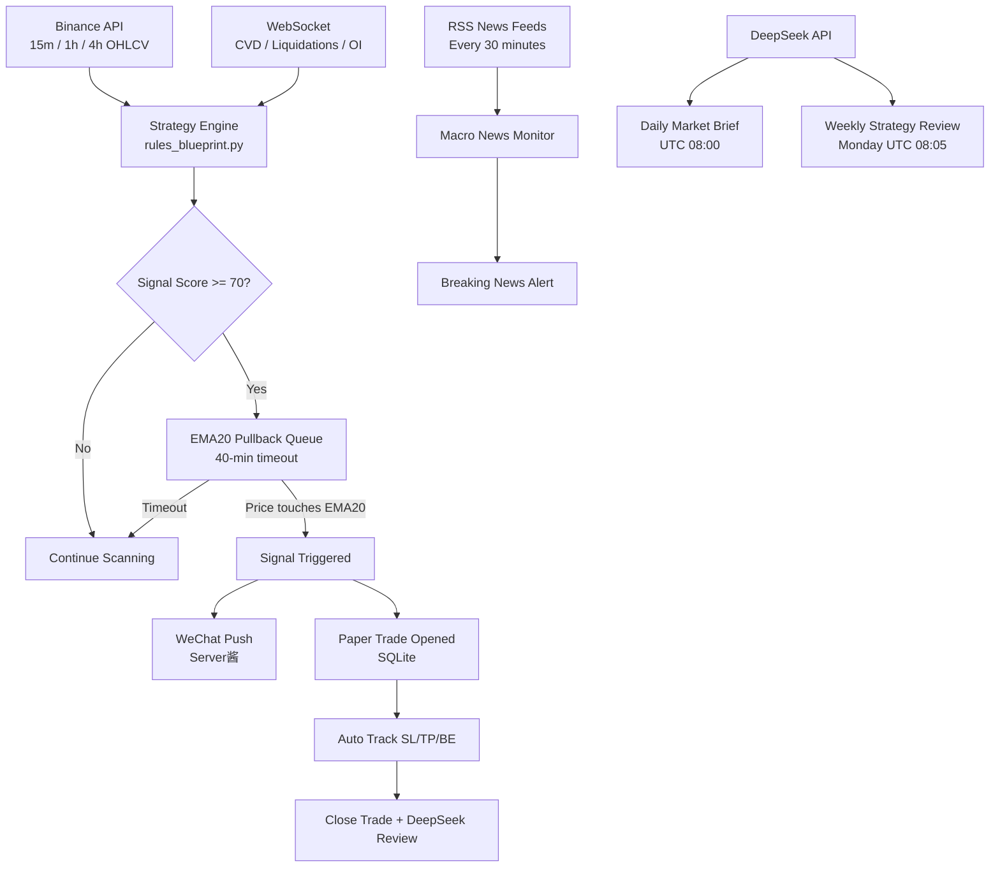

# ETH/USDT Quantitative Trading Signal System

A production-deployed algorithmic trading signal system for ETH/USDT with AI-powered analysis, macro news monitoring, and automated paper trading tracking.


[](https://crypto-bot-kagmts7lraqwzmkumfeeqx.streamlit.app)

---

## 🌐 Live Demo
👉 [View Interactive Dashboard](https://crypto-bot-kagmts7lraqwzmkumfeeqx.streamlit.app)

---

## Backtest Results


| Metric | Value |
|--------|-------|
| Backtest Period | 2 Years (2024–2026) |
| Profit Factor | 2.60 |
| Annual Return | +46.43% |
| Max Drawdown | 4.14% |
| Win Rate | 33.8% |
| Total Trades | 68 |
| Strategy | EMA20 Pullback + 3R TP + 1R Breakeven |

---

## Strategy Discovery

| Version | Entry Method | Profit Factor | Outcome |
|---------|-------------|---------------|---------|
| V1 | Breakout entry | 0.95 | Losing — fees consumed all profits |
| V2 | EMA20 pullback | 1.94 | Positive expectancy discovered |
| V3 | Pullback + breakeven stop | 3.04 | Significant improvement |
| Final | 2-year validation | 2.60 | Robust and reproducible |

The single most impactful discovery was switching from breakout entry to EMA20 pullback entry. Breakout entries resulted in high fees with low win rates. Waiting for price to pull back to EMA20 (±0.3%) dramatically improved signal quality — reducing trade frequency from 379 to 44 trades per year while improving Profit Factor from 0.95 to 1.94.

For the full iteration history and stage-by-stage comparison, see [`docs/backtest_results.md`](docs/backtest_results.md).

---

## System Architecture



---

## Features

- Real-time signal scanning every 10 seconds
- EMA20 pullback entry detection with 40-minute timeout
- Automated paper trading with SL/TP/BE tracking
- DeepSeek AI daily market brief (UTC 08:00)
- DeepSeek AI trade review on every closed position
- Weekly strategy performance review (Monday UTC 08:05)
- Macro news monitoring every 30 minutes (CoinDesk, Reuters, CoinTelegraph)
- ATR extreme volatility alerts
- WeChat push notifications via Server酱
- SQLite persistence for all paper trades

---

## Tech Stack

| Category | Technologies |
|----------|-------------|
| Language | Python 3.10+ |
| Async Framework | asyncio, aiohttp |
| Data & Indicators | pandas, pandas-ta-classic, numpy |
| Exchange API | Binance Futures REST + WebSocket |
| AI Analysis | DeepSeek API |
| Notifications | Server酱 (WeChat) |
| Database | SQLite |
| Charting | mplfinance, matplotlib |
| Deployment | Linux VPS, tmux |

---

## Quick Start

```bash
git clone https://github.com/kevin6667890/crypto-bot.git
cd crypto-bot
pip install -r requirements.txt
cp .env.example .env
# Fill in your API keys in .env
python ultimate_bot.py
```

---

## Project Structure

```
crypto-bot/
├── ultimate_bot.py       # Main bot — async engine, signal detection, notifications
├── rules_blueprint.py    # Strategy core — indicators, trend analysis, scoring
├── backtest/
│   └── backtest_g.py     # Backtesting engine with multi-symbol support
├── dashboard/
│   └── guirecord.py      # Local portfolio tracking dashboard
├── docs/
│   ├── backtest_results.png
│   └── backtest_results.md
├── .env.example
└── requirements.txt
```

---

## Disclaimer

This project is for educational and research purposes only. It does not constitute financial advice. Cryptocurrency trading involves substantial risk of loss. Past backtest performance does not guarantee future results.
