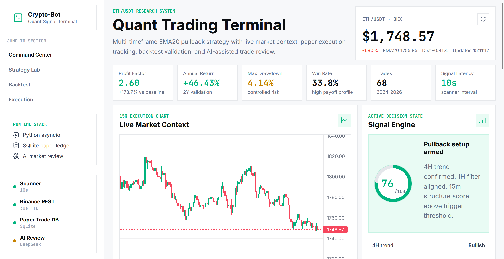
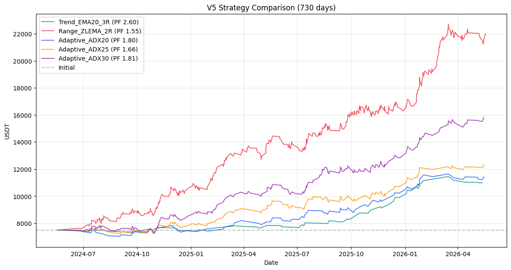
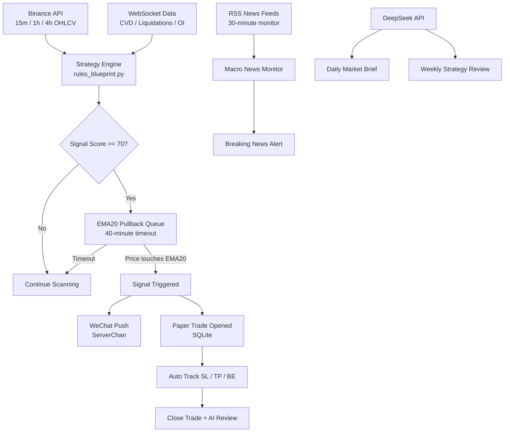

# ETH/USDT Quantitative Trading Signal System

An end-to-end algorithmic trading research project for ETH/USDT. The system combines multi-timeframe signal generation, backtesting, paper trade tracking, AI-assisted reviews, and a redesigned terminal-style web dashboard.


## Terminal Dashboard

The repository now includes a standalone React trading workspace in [`frontend/`](frontend). It uses an OKX-inspired light interface: white surfaces, black typography, restrained borders, and green/red accents only for market state.



```bash
cd frontend
npm install
npm run dev
```

Open `http://127.0.0.1:5173`.

Dashboard highlights:

- Command center with live ETH/USDT market context
- Real-time ETH-USDT ticker and 15m candles via Binance, with OKX public market data fallback
- TradingView Lightweight Charts candlestick and equity visualizations
- Strategy signal state, score breakdown, and risk conditions
- Strategy discovery timeline from failed breakout entries to the final validated setup
- Backtest intelligence panel with risk-adjusted strategy comparison
- Paper execution console, order-flow snapshot, and AI review summary

The legacy Streamlit dashboard is still available at [`dashboard/streamlit_app.py`](dashboard/streamlit_app.py).

## Strategy Snapshot

Final selected strategy:

- **Entry:** EMA20 pullback after signal trigger
- **Filter:** 4H trend + 1H confirmation + 15m structure score
- **Trigger threshold:** score >= 70
- **Exit:** 3R take profit
- **Risk control:** 1R break-even stop and structure-based stop loss
- **Market:** ETH/USDT

## Backtest Results

| Metric | Value |
| --- | ---: |
| Backtest Period | 2 years |
| Profit Factor | 2.60 |
| Annual Return | +46.43% |
| Max Drawdown | 4.14% |
| Win Rate | 33.8% |
| Total Trades | 68 |



## Strategy Evolution

| Stage | Entry Method | Trades | Profit Factor | Outcome |
| --- | --- | ---: | ---: | --- |
| V1 | Breakout / range entry | 379 | 0.95 | Rejected because fees and false breakouts destroyed expectancy |
| V2 | EMA20 pullback | 44 | 1.94 | Positive expectancy discovered |
| V3 | Pullback + 1R break-even | 44 | 3.04 | Best single optimization step |
| Final | Multi-timeframe score + EMA20 pullback | 68 | 2.60 | More robust two-year validation |

Full notes are in [`docs/backtest_results.md`](docs/backtest_results.md).

## System Architecture



## Core Features

- Async real-time signal scanner
- EMA20 pullback queue with timeout logic
- Multi-timeframe trend and structure scoring
- Backtesting engine with multi-strategy comparison
- Automated paper trade ledger
- Stop-loss, take-profit, and break-even tracking
- AI daily market brief and closed-trade review
- Macro news monitoring
- Docker-ready deployment
- React terminal dashboard for portfolio presentation

## Tech Stack

| Layer | Technologies |
| --- | --- |
| Trading Engine | Python 3.10, asyncio, aiohttp |
| Data & Indicators | pandas, numpy, pandas-ta-classic |
| Exchange Connectivity | Binance REST / WebSocket, ccxt |
| Persistence | SQLite |
| AI Analysis | DeepSeek API |
| Notifications | ServerChan / WeChat |
| Frontend | React, TypeScript, Vite, Lightweight Charts, Framer Motion |
| Testing & Deployment | pytest, GitHub Actions, Docker |

## Quick Start

Run the trading system:

```bash
git clone https://github.com/kevin6667890/crypto-bot.git
cd crypto-bot
pip install -r requirements.txt
cp .env.example .env
python ultimate_bot.py
```

Run tests:

```bash
pip install pytest pytest-asyncio
pytest tests/ -v
```

Run the terminal frontend:

```bash
cd frontend
npm install
npm run dev
```

Run with Docker:

```bash
docker-compose up -d
```

## Project Structure

```text
crypto-bot/
├── ultimate_bot.py          # Async trading engine and signal runtime
├── rules_blueprint.py       # Strategy rules, indicators, and scoring
├── backtest/
│   └── backtest_g.py        # Backtesting engine
├── dashboard/
│   ├── streamlit_app.py     # Legacy Streamlit dashboard
│   └── guirecord.py         # Local portfolio tracker
├── frontend/                # React terminal dashboard
├── docs/
│   ├── backtest_results.png
│   └── backtest_results.md
├── tests/
└── requirements.txt
```

## Disclaimer

This project is for educational and research purposes only. It is not financial advice. Cryptocurrency trading involves substantial risk, and backtest results do not guarantee future performance.
