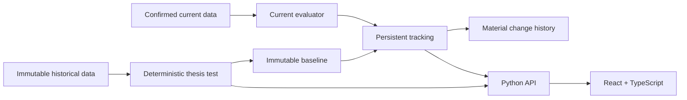

# Crypto-Bot — Evidence, not predictions

An evidence-driven crypto research system that turns market hypotheses into reproducible historical tests and tracks how current evidence changes.

**Live demo:** [bitcoinbot.uk](https://bitcoinbot.uk/?utm_source=github&utm_medium=repository)


**Product flow:** Test → Evidence → Track → Change → Revisit

Crypto-Bot is a research product, not an automated-profit claim, price predictor, or live-order execution service. I built the deterministic research and tracking boundaries, React product surface, background-worker and SQLite operations, production safeguards, and validation suite.

## What it does

- Validates a plain-language or manually-built thesis against an explicit capability registry.
- Tests independent historical events on immutable, identity-checked data.
- Shows coverage, event provenance, K-line context, distributions, and limits.
- Saves the exact historical baseline and reevaluates it on confirmed current data.
- Records material changes rather than treating every market tick as a signal.

The registry supports BTC, ETH, and SOL. Supported conditions, timeframes, horizons, and data availability come from the running capability registry; unsupported conditions fail closed instead of being silently approximated. Confirmed rolling breakouts/breakdowns and confirmed failed structures are supported where their required OHLCV history qualifies. Historical derivative coverage is conditional on a qualified immutable snapshot; unavailable OI/CVD conditions remain unavailable.

## Evidence integrity

Historical and current evidence have separate identities. Historical tests use immutable data, confirmed candles, causal warm-up, explicit event spacing, and no future-bar leakage. `UNKNOWN` is not converted to `FALSE`. The browser renders backend results; it does not calculate statistics.

AI is optional. It may produce a validated draft definition or explain an audited fact set, but cannot create sample counts, returns, conditions, or trading instructions. AI-assisted development was used for implementation iteration; architecture, validation, production acceptance, and research semantics were explicitly reviewed.

## Product surfaces

- **Test an idea:** historical evidence and inspectable event context.
- **Tracking / What Changed:** immutable baselines and material current-evidence changes.
- **Prediction Markets:** independent forecasts, immutable commitments, and resolution-aware scorekeeping—not trading signals.
- **Advanced:** the wider research workspace, including canonical current evidence and operations views.

## Production engineering

The public deployment uses Docker Compose, Nginx, persistent SQLite stores, background workers, health/readiness gates, and confirmed market-data ingestion. A SQLite WAL growth incident exposed a checkpoint-starvation path: a continuously non-empty writer queue could indefinitely defer checkpoints. The collector preserves low-I/O behavior for small WALs while enforcing a bounded checkpoint guard under sustained pressure, with regression coverage.

## Architecture


```mermaid
flowchart LR
  H[Immutable historical data] --> T[Deterministic thesis test]
  C[Confirmed current data] --> E[Current evaluator]
  T --> B[Immutable baseline]
  B --> R[Persistent tracking]
  E --> R
  R --> W[Material change history]
  T --> A[Python API]
  R --> A
  A --> U[React + TypeScript]
```

## Testing

CI runs Python tests, compilation, lightweight linting, frontend API checks, unit tests, production build, Docker Compose validation/build, and a bounded fixture-based Playwright smoke suite. The browser suite has no production, OKX, or AI-provider dependency and covers product mounting/navigation, V1/V2 thesis fixtures, tracking/change behavior, Advanced mounting, and Prediction Markets fixture states.

## Run locally

Development does not need production secrets:

```bash
python -m pip install -r requirements.txt
pytest -q
python -m dashboard.paper_api

# another terminal
cd frontend
npm ci
npm run api:check
npm test
npm run build
```

Open `http://127.0.0.1:5173`.

Production-like thesis mode additionally needs a configured immutable historical database, its SHA-256 and dataset ID, plus a durable tracking database. See [operations](docs/OPERATIONS.md). Never commit those databases, runtime files, or secrets.

```bash
docker compose config
docker compose up -d --build paper-api frontend
```

## Limitations

- Research coverage is limited to the registry's supported assets, timeframes, and qualified datasets.
- Derivative conditions depend on an independently qualified immutable source.
- CVD has native historical-source limits; absence is shown, not filled in.
- The public product never places live orders.
- Historical evidence is not predictive certainty or financial advice.

## Documentation

- [Portfolio v1 handoff and maintenance policy](docs/PORTFOLIO_V1.md)
- [Interview handoff](docs/INTERVIEW_HANDOFF.md)
- [Operations](docs/OPERATIONS.md)
- [Thesis capability contract](docs/thesis_capability_v2.md)
- [Research API](docs/API.md)

Feature work is frozen after v1.0.0. See the maintenance policy before adding anything new.
