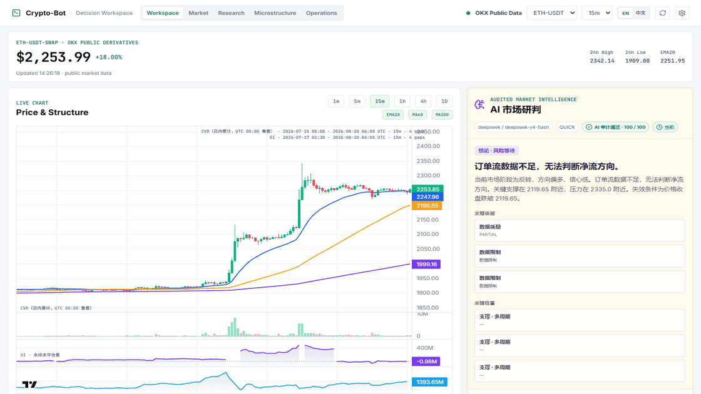
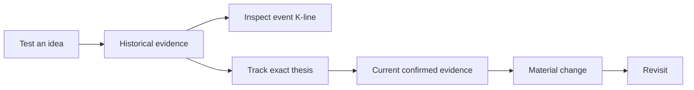
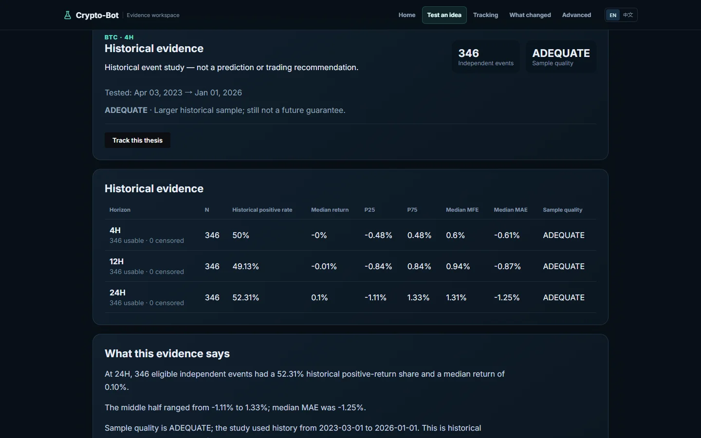
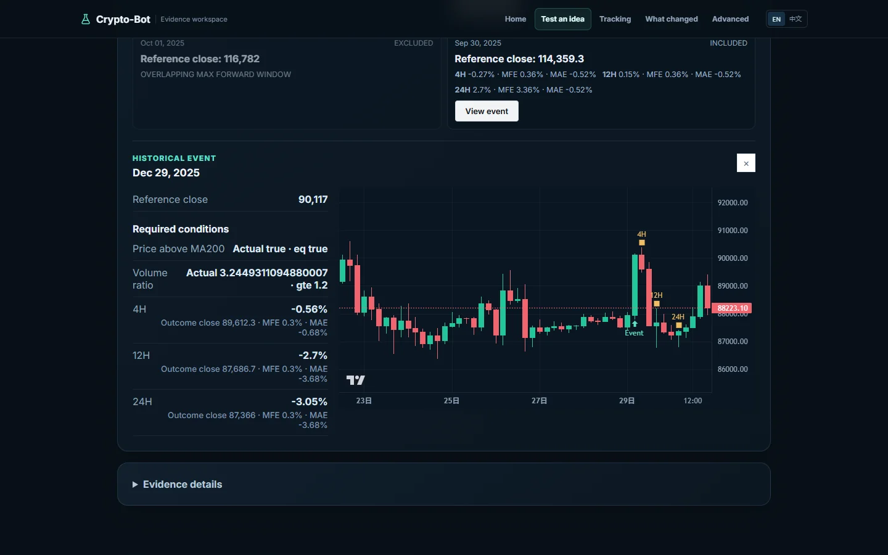
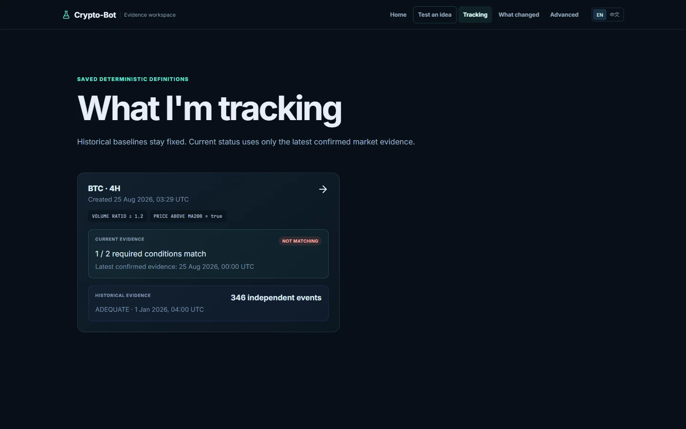
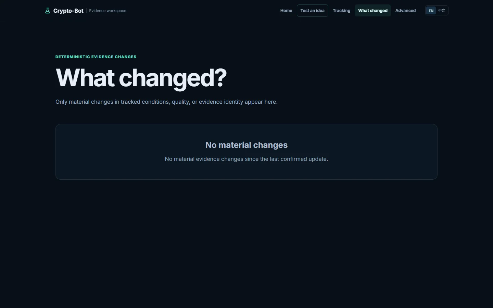
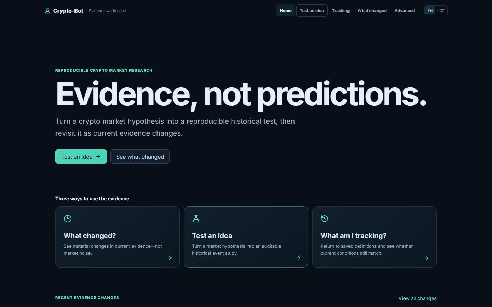
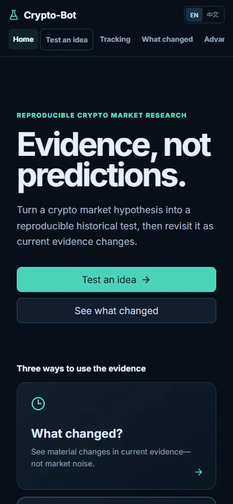
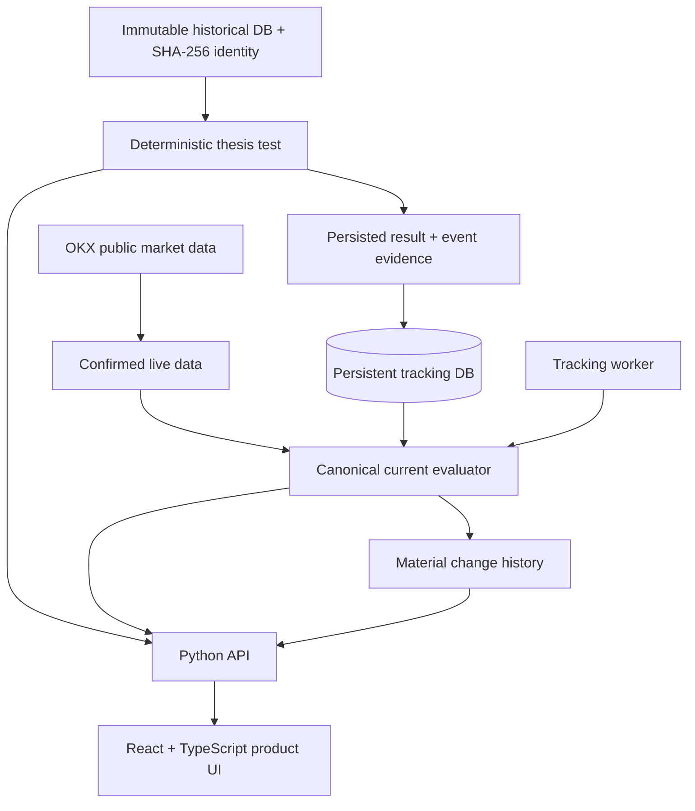

# Crypto-Bot — Evidence, not predictions

An evidence-driven crypto research system that turns market hypotheses into reproducible historical tests and tracks how current evidence changes.

**Live Demo: [bitcoinbot.uk](https://bitcoinbot.uk)**

**Product flow:** Test → Evidence → Track → Change → Revisit



Crypto-Bot is a production-deployed research product, not a prediction engine or a live trading service. It uses real market data, deterministic statistics, immutable historical evidence, and confirmed current candles. No exchange account or API key is required for the public product.

## What it does

- Turns a plain-language or manually constructed thesis into an auditable definition.
- Measures independent historical events over 4H, 12H, and 24H forward horizons.
- Shows coverage, sample quality, return distributions, event provenance, and K-line context.
- Saves the exact historical baseline and reevaluates the same definition against current confirmed evidence.
- Records only material changes so a thesis can be revisited without treating every market tick as a new signal.

Supported thesis assets are **BTC, ETH, and SOL**. The primary thesis timeframes are **1H and 4H**.

## Product flow


```mermaid
flowchart LR
    T[Test an idea] --> E[Historical evidence]
    E --> K[Inspect event K-line]
    E --> R[Track exact thesis]
    R --> C[Current confirmed evidence]
    C --> D[Material change]
    D --> V[Revisit]
```

The historical baseline never moves after tracking. Current evaluation has a separate dataset identity and uses the latest confirmed candle; `UNKNOWN` is never silently treated as `FALSE`.

## Test an idea

The deterministic thesis engine owns the definition and all statistics. A successful test exposes the raw and evaluable ranges, independent sample count, sample-quality classification, horizon aggregates, exclusions, feature versions, and reproducible evidence identifiers.



The production example shown here tests BTC 4H with `VOLUME_RATIO >= 1.2` and `PRICE_ABOVE_MA200 == true`. The displayed values come from the deployed immutable historical dataset, not hardcoded demo data.

## Evidence integrity

Every included event can be opened as a K-line view with the actual condition values and forward outcomes.



Research integrity is enforced by design:

- Historical thesis tests require a configured immutable database and matching SHA-256; they fail closed on identity mismatch.
- Historical tests cannot fall back to the recent live candle cache.
- Indicators use confirmed candles with complete warm-up and no future-bar leakage.
- Independent-event spacing and exclusions are explicit and versioned.
- The frontend renders backend results; it does not recompute research statistics.
- AI may interpret an idea or explain evidence, but it does not generate sample counts, returns, or research claims.

## Track a thesis

Tracking preserves the original definition and historical result as an immutable baseline. A background worker and manual refresh share the same deterministic current-evaluation semantics, and the tracking database persists across container restarts.



Historical and current evidence identities remain visibly separate. A current status can be `MATCHING`, `NOT_MATCHING`, or `UNKNOWN`; it is evidence state, not a trade instruction.

## What changed

The change feed contains only material condition, quality, status, or dataset-identity changes. A real empty state is shown when nothing material changed—there are no hardcoded events.



## Product home and mobile

The bilingual product shell exposes three direct entry points—What changed, Test an idea, and What am I tracking—with the Advanced research system kept available for deeper work.

<table>
  <tr>
    <td></td>
    <td width="28%"></td>
  </tr>
</table>

## Architecture


```mermaid
flowchart TD
    OKX[OKX public market data] --> LIVE[Confirmed live data]
    FROZEN[Immutable historical DB + SHA-256 identity] --> TEST[Deterministic thesis test]
    TEST --> RESULT[Persisted result + event evidence]
    RESULT --> TRACK[(Persistent tracking DB)]
    LIVE --> EVAL[Canonical current evaluator]
    TRACK --> EVAL
    EVAL --> CHANGE[Material change history]
    TEST --> API[Python API]
    EVAL --> API
    CHANGE --> API
    API --> UI[React + TypeScript product UI]
    WORKER[Tracking worker] --> EVAL
```

The deployment uses Docker Compose, an Nginx-served React frontend, Python API services, a dedicated thesis tracking worker, and persistent SQLite stores. Production readiness reports historical, current, tracking, parser, explanation, and scheduler status independently.

## AI vs deterministic boundary

AI is optional. It can parse natural language into a draft definition and produce a grounded explanation from deterministic facts. If the provider is unavailable, the manual builder and deterministic explanation remain usable.

AI cannot calculate or alter research statistics, change condition truth values, select a strategy, modify risk controls, activate execution, or create an order. Statistical outputs, dataset identities, and current evaluation remain deterministic.

## Research integrity

- Confirmed-candle evaluation and causal feature computation.
- Versioned dataset, feature, engine, coverage, and independence policies.
- Immutable tracked historical baselines and idempotent scheduler evaluation.
- Explicit missing-data states; `UNKNOWN != FALSE`.
- No fabricated historical CVD or open-interest values.
- Paper-only execution architecture; no public live-order path.

## Current limitations

Canonical confirmed/failed breakout thesis tests and historical OI/CVD conditions are intentionally deferred. The product reports these clauses as unsupported and does not substitute easier conditions.

## Advanced research system

The legacy Advanced workspace remains available at [/advanced](https://bitcoinbot.uk/advanced), including Workspace, Market, Research, Microstructure, and Operations. It contains the broader research platform: causal backtesting, experiment governance, walk-forward/holdout/OOT evaluation, strategy registry, MarketStateV2, paper execution, microstructure evidence, and audited AI reports.

The thesis product does not alter MarketState definitions, strategy logic, risk controls, or trading behavior.

## Tech stack

| Layer | Technology |
|---|---|
| Frontend | React, TypeScript, Vite, lightweight-charts |
| Backend | Python API and background workers |
| Storage | SQLite evidence, tracking, research, and paper stores |
| Data | Real OKX public market data |
| Deployment | Docker Compose, Nginx, health/readiness gates |
| Testing | pytest, Vitest, Playwright |

## Run locally

```bash
# Backend
python -m pip install -r requirements.txt
python -m dashboard.paper_api

# Frontend (second terminal)
cd frontend
npm ci
npm run dev
```

Open `http://127.0.0.1:5173`. For a production-like thesis deployment, configure an immutable historical database, its SHA-256 and dataset ID, plus a persistent tracking database; see [operations documentation](docs/OPERATIONS.md).

```bash
docker compose up -d --build paper-api frontend
```

## Verification

```bash
pytest -q
python -m compileall dashboard tests scripts
cd frontend
npm run api:check
npm test
npm run build
```

Portfolio media can be reproduced from the accepted deployment without synthetic returns:

```powershell
$env:PORTFOLIO_BASE_URL="https://bitcoinbot.uk"
python scripts/build_portfolio_assets.py
```

The capture validates 1440px and 390px viewports, English and Chinese layouts, image dimensions, real tracking persistence, automatic smoke-track archival, and visible-text privacy boundaries.

## Documentation

- [Operations and deployment](docs/OPERATIONS.md)
- [Research API](docs/API.md)
- [Research and strategy discovery architecture](docs/strategy_discovery_architecture.md)
- [AI analysis architecture and safety boundary](docs/ai_market_analysis/README.md)
- [Market state engine](docs/market_state_engine_v2.md)
- [Strategy router](docs/strategy_router_v2.md)
- [Microstructure readiness](docs/microstructure_research_readiness.md)
- [Storage lifecycle](docs/storage_lifecycle_v2.md)

For educational and research purposes only. Historical, paper, or backtest results do not predict future performance and are not financial advice.
