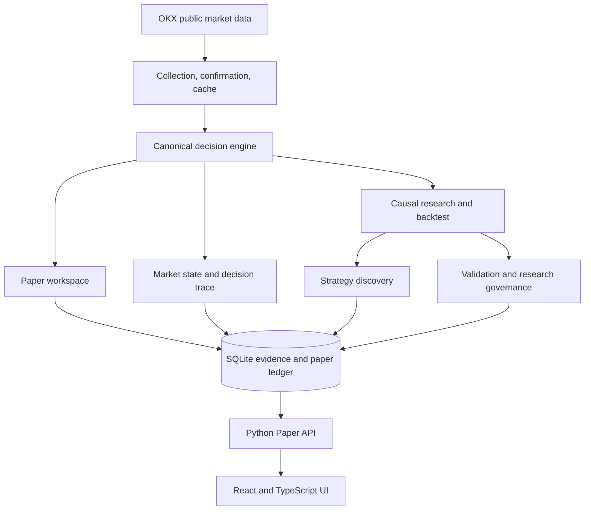
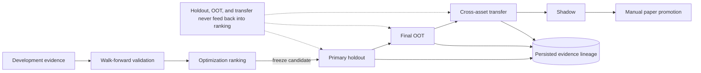
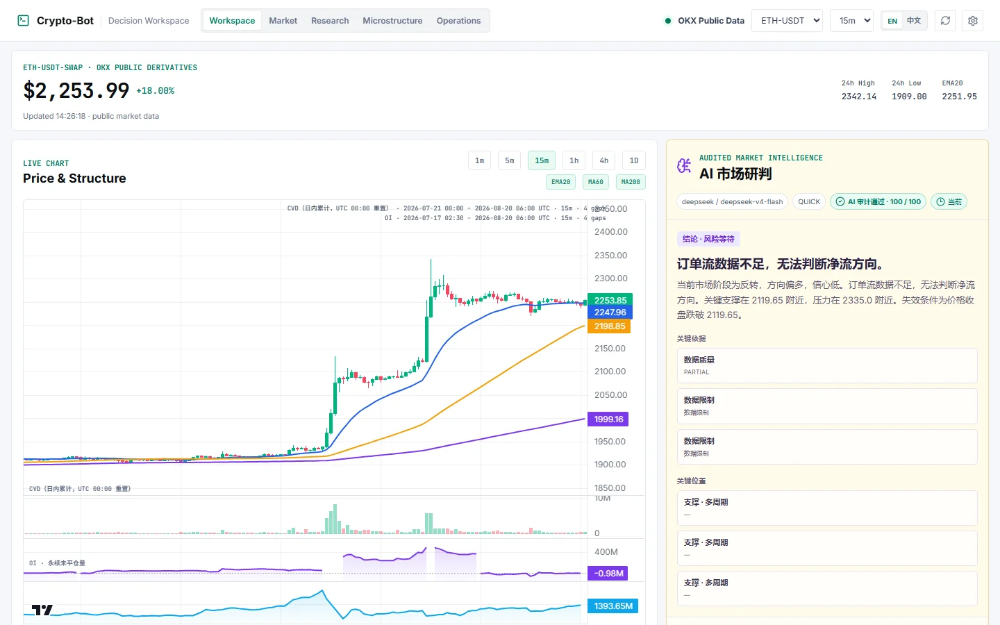
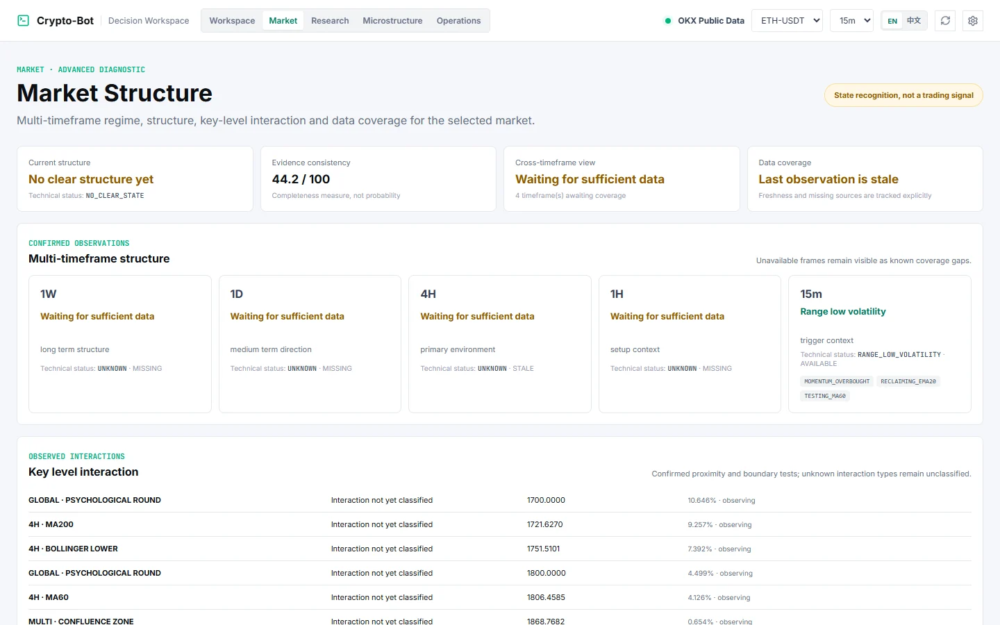
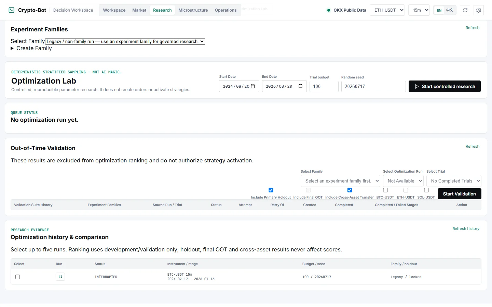
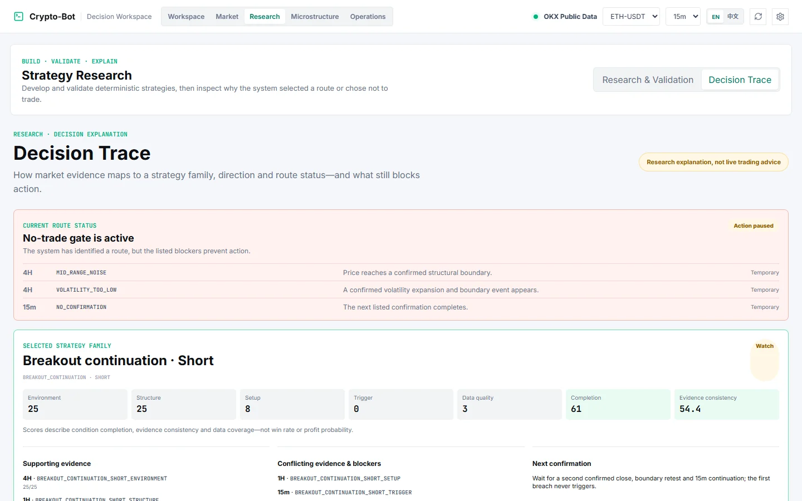

# Crypto-Bot Research Platform

A production-style crypto strategy research and paper-trading platform focused on causal evaluation, reproducible experiments, and out-of-time validation.

[](https://github.com/kevin6667890/crypto-bot/actions/workflows/ci.yml)     


Crypto-Bot joins real OKX market data, a deterministic decision engine, causal historical research, governed strategy discovery, and paper execution in one auditable workspace. It sends no live exchange orders; AI is limited to descriptive summaries and explanations.

## Why this is more than a backtester

1. **Causal evaluation.** Signals are confirmed at candle close and executed at the next candle open, after complete indicator warm-up and without future-bar leakage.
2. **Research leakage control.** Experiment families lock development, primary holdout, and optional final OOT periods. Holdout reveal is explicit and durable; later search-space changes mark the evidence as contaminated.
3. **Reproducible lineage.** Canonical configuration hashes, SHA-256 signal IDs, persisted run lineage, and exact Paper/Research reconciliation make results traceable across restarts.
4. **Validation beyond in-sample results.** Walk-forward, hidden holdout, final OOT, ETH/SOL transfer, bootstrap/Monte Carlo, and stress tests are recorded. OOT and transfer evidence never changes optimization ranking.
5. **Manual strategy lifecycle.** Discovery → validation → Shadow → Paper promotion is evidence-driven and manual. Backtest return alone cannot activate a strategy.

## At a glance

| | |
|---|---|
| Frontend | React, TypeScript, Vite, lightweight-charts |
| Backend | Python Paper API and deterministic research services |
| Storage | SQLite with persisted jobs, evidence, and paper ledger |
| Market data | OKX public candles, trades, ticker, and perpetual OI |
| Assets | BTC, ETH, and SOL research coverage |
| Research | Causal backtest, walk-forward, holdout, final OOT, transfer |
| Execution | Paper only; no exchange keys or live orders |
| Deployment | Docker Compose and Nginx |
| AI boundary | Descriptive market summaries and explanations only |

## Architecture


```mermaid
flowchart TD
    OKX[OKX public market data] --> DC[Collection, confirmation, cache]
    DC --> DE[Canonical decision engine]
    DE --> PAPER[Paper workspace]
    DE --> RESEARCH[Causal research and backtest]
    DE --> ROUTER[Market state and decision trace]
    RESEARCH --> DISCOVERY[Strategy discovery]
    RESEARCH --> GOVERNANCE[Validation and research governance]
    PAPER --> DB[(SQLite evidence and paper ledger)]
    ROUTER --> DB
    DISCOVERY --> DB
    GOVERNANCE --> DB
    DB --> API[Python Paper API]
    API --> UI[React and TypeScript UI]
```

## Research lifecycle


```mermaid
flowchart LR
    D[Development evidence] --> W[Walk-forward validation]
    W --> R[Optimization ranking]
    R -->|freeze candidate| H[Primary holdout]
    H --> O[Final OOT]
    O --> X[Cross-asset transfer]
    X --> S[Shadow]
    S --> P[Manual paper promotion]
    H --> E[(Persisted evidence lineage)]
    O --> E
    X --> E
    N[Holdout, OOT, and transfer never feed back into ranking] -.-> H
    N -.-> O
    N -.-> X
```

Only development and walk-forward evidence can affect optimization ranking. Later stages test a frozen candidate and remain descriptive evidence for a manual lifecycle decision.

## Product tour

<table>
  <tr>
    <td></td>
    <td></td>
  </tr>
  <tr>
    <td><strong>Workspace</strong><br>Current market context, deterministic decision, rule evidence, and paper risk state.</td>
    <td><strong>Market Structure</strong><br>Multi-timeframe state, key-level interaction, freshness, and explicit coverage gaps.</td>
  </tr>
  <tr>
    <td></td>
    <td></td>
  </tr>
  <tr>
    <td><strong>Research</strong><br>Persisted optimization evidence, locked holdouts, validation suites, and contamination tracking.</td>
    <td><strong>Decision Trace</strong><br>Selected strategy family, supporting evidence, blockers, and the next required confirmation.</td>
  </tr>
</table>

## Engineering highlights

- One canonical `evaluate_decision` path shared by paper execution and historical research.
- Canonical JSON configuration hashes and deterministic signal identities.
- Restart-safe SQLite job queue with limits, deduplication, cancellation, and retries.
- Real OKX ingestion with confirmation filtering, deduplication, pagination, gap reporting, and caching.
- Causal next-bar execution with explicit fees, slippage, and conservative intrabar collision handling.
- Durable experiment-family lineage, holdout reveal, OOT suites, and contamination audit flags.
- Exact Paper/Research reconciliation instead of inferred matches.
- Dockerized Python API and Nginx-served React production architecture.

## Research integrity

- Research and paper trading only; the project does not place live orders.
- Confirmed candles only, causal indicators, complete slow-MA warm-up, and next-candle-open execution.
- Fees and adverse slippage are applied; a same-bar stop/target collision records the stop first.
- Historical CVD/OI is never fabricated. Missing or partial coverage remains visible and cannot silently become zero.
- Primary holdouts are hidden until an explicit, durable reveal. Final OOT and cross-asset results never affect ranking.
- Strategy promotion is manual; there is no AI parameter search, online self-learning, or automatic activation.

## Quick start

```bash
# Backend
python -m pip install -r requirements.txt
python -m dashboard.paper_api

# Frontend (second terminal)
cd frontend
npm ci
npm run dev
```

Open `http://127.0.0.1:5173`.

```bash
# Docker
docker compose up -d --build paper-api frontend
```

## Reproduce the portfolio assets

The screenshots, looping README GIF, and approximately 41-second H.264 demo are generated from the real application with Playwright and ffmpeg:

```bash
python scripts/build_portfolio_assets.py
```

The command connects to healthy local services or starts them, captures fixed viewports, converts and verifies the media, prints dimensions and file sizes, and shuts down only the processes it created. It requires an existing real `data_cache/paper_trades.db`; it never synthesizes profitable results. The MP4 is written to `artifacts/portfolio-demo/crypto-bot-demo.mp4` and intentionally ignored by Git.

## Documentation

- [Research and strategy discovery architecture](docs/strategy_discovery_architecture.md)
- [Research API](docs/API.md)
- [Operations and deployment](docs/OPERATIONS.md)
- [Market state engine](docs/market_state_engine_v2.md)
- [Strategy router](docs/strategy_router_v2.md)
- [Microstructure research readiness](docs/microstructure_research_readiness.md)
- [Storage lifecycle](docs/storage_lifecycle_v2.md)

## Verification

```bash
pytest -q
python -m compileall dashboard tests scripts
cd frontend && npm run api:check && npm test && npm run build
```

For educational and research purposes only. Historical, paper, or backtest results do not predict future performance and are not financial advice.
