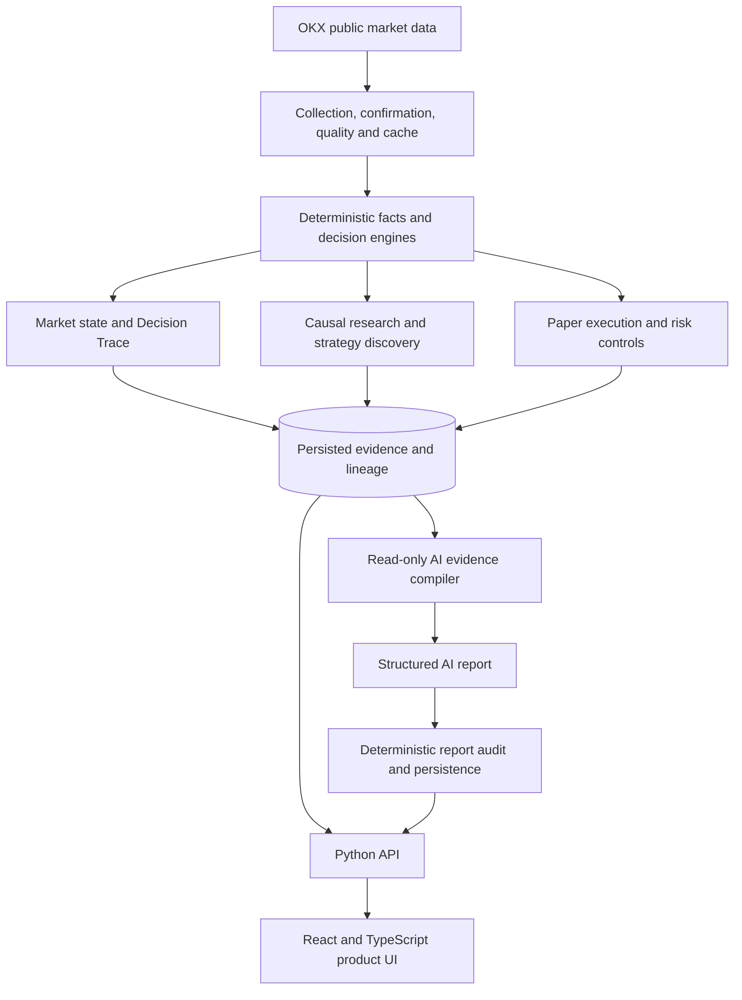
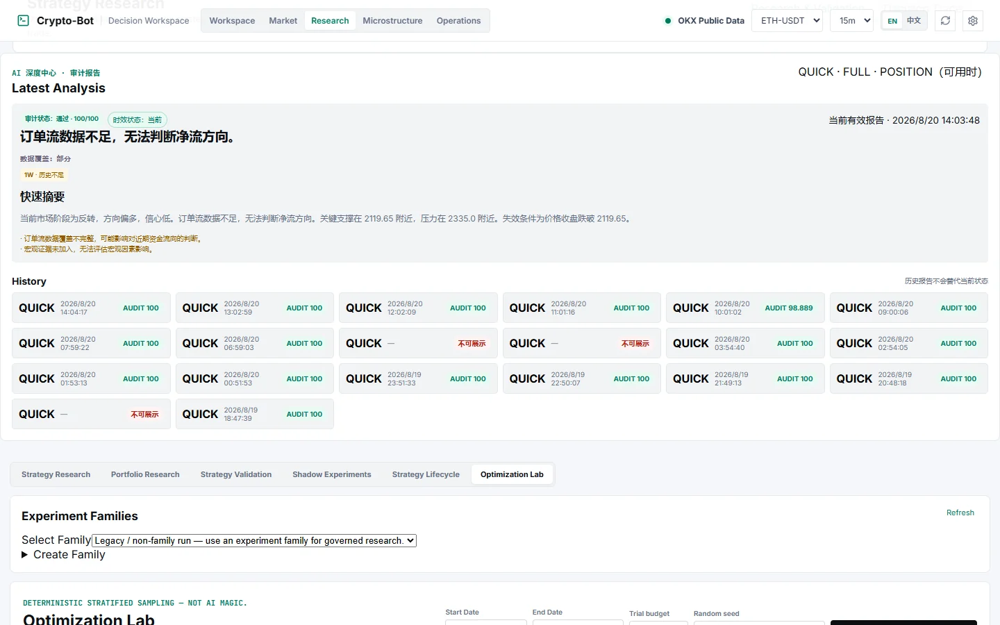

# Crypto-Bot Research Platform

A production-style crypto strategy research and paper-trading platform focused on causal evaluation, reproducible experiments, and out-of-time validation.

[](https://github.com/kevin6667890/crypto-bot/actions/workflows/ci.yml)     

**[Live Demo](https://bitcoinbot.uk)** · [Architecture](#architecture) · [Documentation](#documentation)

Public research and paper-trading interface. No exchange account, API key, or live trading is required.


Crypto-Bot combines real OKX market data, deterministic decision logic, causal historical research, governed strategy discovery, evidence-grounded AI analysis, and paper execution in one auditable workspace. It is a full-stack engineering project—not a live trading service—and it never sends orders to an exchange.

## Why this is more than a backtester

1. **Causal evaluation.** Signals are confirmed at candle close and executed at the next candle open, after complete indicator warm-up and without future-bar leakage.
2. **Research governance.** Experiment families separate development, walk-forward validation, hidden holdout, final out-of-time (OOT), and cross-asset transfer evidence. Search-space changes after a reveal mark the family as contaminated.
3. **Reproducible lineage.** Canonical configuration hashes, SHA-256 signal identities, persisted evidence, and exact Paper/Research reconciliation make results traceable across processes and restarts.
4. **Production-style operations.** The system combines a React UI, Python services, persistent jobs, SQLite evidence stores, public market-data ingestion, health checks, alerts, and Docker/Nginx deployment.
5. **Explainable decisions.** Market Structure and Decision Trace show what the deterministic engine observed, which rule blocked action, and what confirmation would be needed next.

## At a glance

| | |
|---|---|
| Live demo | [bitcoinbot.uk](https://bitcoinbot.uk) |
| Frontend | React, TypeScript, Vite, lightweight-charts |
| Backend | Python Paper API, research services, and background workers |
| Storage | SQLite stores for jobs, evidence lineage, AI reports, and the paper ledger |
| Market data | Real OKX public candles, trades, ticker, and perpetual open interest |
| Assets | BTC, ETH, and SOL |
| Research | Causal backtesting, walk-forward, hidden holdout, final OOT, and transfer tests |
| Execution | Paper only; no exchange credentials or live order path |
| AI role | Audited explanation of persisted evidence; never a strategy or execution authority |
| Deployment | Docker Compose with an Nginx-served React frontend and same-origin API |

## Architecture


```mermaid
flowchart TD
    OKX[OKX public market data] --> DATA[Collection, confirmation, quality and cache]
    DATA --> ENGINE[Deterministic facts and decision engines]
    ENGINE --> STATE[Market state and Decision Trace]
    ENGINE --> RESEARCH[Causal research and strategy discovery]
    ENGINE --> PAPER[Paper execution and risk controls]
    STATE --> STORE[(Persisted evidence and lineage)]
    RESEARCH --> STORE
    PAPER --> STORE
    STORE --> API[Python API]
    API --> UI[React and TypeScript product UI]
    STORE --> CONTEXT[Read-only AI evidence compiler]
    CONTEXT --> REPORT[Structured AI report]
    REPORT --> AUDIT[Deterministic report audit and persistence]
    AUDIT --> API
```

The AI path has no control edge back into signals, research ranking, risk rules, strategy activation, or paper execution. Deterministic engines and persisted evidence remain the source of truth.

## Research lifecycle


```mermaid
flowchart LR
    D[Development evidence] --> W[Walk-forward validation]
    W --> R[Optimization ranking]
    R -->|freeze candidate| H[Primary holdout]
    H --> O[Final OOT]
    O --> X[Cross-asset transfer]
    X --> S[Shadow]
    S --> P[Manual paper promotion]
    H --> E[(Persisted evidence lineage)]
    O --> E
    X --> E
    N[Holdout, OOT and transfer never feed back into ranking] -.-> H
    N -.-> O
    N -.-> X
```

Only development and walk-forward evidence can affect optimization ranking. Holdout, final OOT, and transfer results test a frozen candidate; they cannot feed back into ranking and remain evidence for a manual lifecycle decision.

## Product tour

<table>
  <tr>
    <td></td>
    <td></td>
  </tr>
  <tr>
    <td><strong>Workspace</strong><br>Live market context, a deterministic paper decision, rule evidence, risk state, and the latest eligible AI analysis.</td>
    <td><strong>Market Structure</strong><br>Multi-timeframe state, key-level interaction, data lineage, freshness, and explicit coverage gaps.</td>
  </tr>
  <tr>
    <td></td>
    <td></td>
  </tr>
  <tr>
    <td><strong>Research</strong><br>Persisted experiment families, locked holdouts, validation suites, and contamination tracking.</td>
    <td><strong>AI Analysis</strong><br>Audit-eligible explanation, source-state freshness, persisted history, and reopenable report deep links.</td>
  </tr>
</table>

## Evidence-grounded AI analysis

The AI report layer consumes a frozen, read-only package of deterministic market and research evidence. Depending on report mode, that package can include confirmed multi-timeframe state, data-quality and lineage flags, order-flow observations, key levels, scenarios, and bounded paper-position context.

Reports are structured, persisted, and tied to their source context, prompt/model versions, evidence registry, and deterministic audit. The UI exposes the latest eligible analysis plus report history and `report_id` deep links. Older reports remain inspectable with freshness labeling; pending or failed-audit reports never expose their generated body as a valid market explanation.

AI can summarize evidence, surface uncertainty and counterevidence, and explain scenarios. It cannot change deterministic signals, choose optimization parameters, influence research ranking, modify risk controls, activate a strategy, or create an order.

## Engineering highlights

- One canonical decision path shared by paper execution and historical research.
- Canonical JSON configuration hashes and deterministic signal identities.
- Restart-safe SQLite job queues with limits, deduplication, cancellation, and retries.
- Real OKX ingestion with confirmation filtering, symbol normalization, pagination, gap reporting, and caching.
- Explicit UTC candle lineage across BTC, ETH, and SOL.
- Causal next-bar execution with fees, adverse slippage, and conservative intrabar collision handling.
- Durable experiment-family lineage, holdout reveal, OOT suites, transfer tests, and contamination flags.
- Exact Paper/Research reconciliation instead of inferred matches.
- AI report identity, immutable evidence registries, deterministic claim audits, retention controls, and kill-switch protection.
- Dockerized Python services and an Nginx-served React production architecture.

## Research integrity

- Confirmed candles only, causal indicators, complete slow-moving-average warm-up, and next-candle-open execution.
- Fees and adverse slippage are applied; a same-bar stop/target collision records the stop first.
- Historical cumulative volume delta (CVD) and open interest (OI) are never fabricated. Missing or partial coverage remains visible and cannot silently become zero.
- Primary holdouts stay hidden until an explicit, durable reveal. Final OOT and cross-asset evidence never affect ranking.
- Strategy promotion is manual. There is no AI parameter search, online self-learning, automatic activation, or live exchange order path.

## Quick start

For a no-install walkthrough, open the **[Live Demo](https://bitcoinbot.uk)**.

```bash
# Backend
python -m pip install -r requirements.txt
python -m dashboard.paper_api

# Frontend (second terminal)
cd frontend
npm ci
npm run dev
```

Open `http://127.0.0.1:5173` for local development.

```bash
# Docker
docker compose up -d --build paper-api frontend
```

## Reproduce the portfolio assets

The screenshots, looping README GIF, and approximately 41-second H.264 demo are generated from the application with Playwright and ffmpeg:

```bash
# Capture the deployed product shown in this README (PowerShell)
$env:PORTFOLIO_BASE_URL="https://bitcoinbot.uk"
python scripts/build_portfolio_assets.py
```

The workflow captures fixed viewports, converts and verifies the media, performs visible-text privacy checks, and shuts down only processes it created. Without `PORTFOLIO_BASE_URL`, local capture requires an existing real `data_cache/paper_trades.db`; it never synthesizes profitable results. The MP4 is written to `artifacts/portfolio-demo/crypto-bot-demo.mp4` and intentionally ignored by Git.

## Documentation

- [AI analysis architecture and safety boundary](docs/ai_market_analysis/README.md)
- [Research and strategy discovery architecture](docs/strategy_discovery_architecture.md)
- [Research API](docs/API.md)
- [Operations and deployment](docs/OPERATIONS.md)
- [Market state engine](docs/market_state_engine_v2.md)
- [Strategy router](docs/strategy_router_v2.md)
- [Microstructure research readiness](docs/microstructure_research_readiness.md)
- [Storage lifecycle](docs/storage_lifecycle_v2.md)

## Verification

```bash
pytest -q
python -m compileall dashboard tests scripts
cd frontend && npm run api:check && npm test && npm run build
```

For educational and research purposes only. Historical, paper, or backtest results do not predict future performance and are not financial advice.
